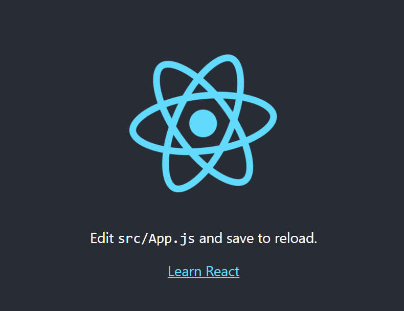
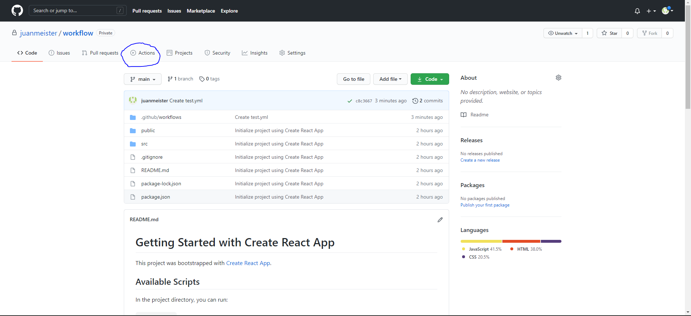
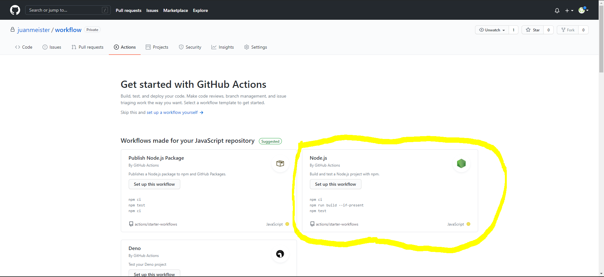
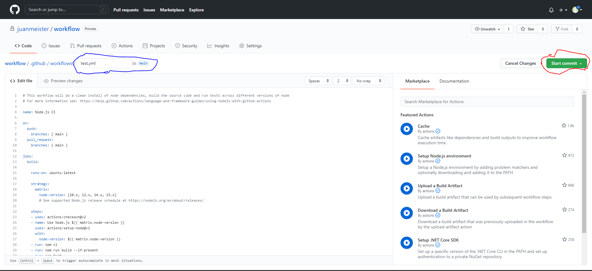
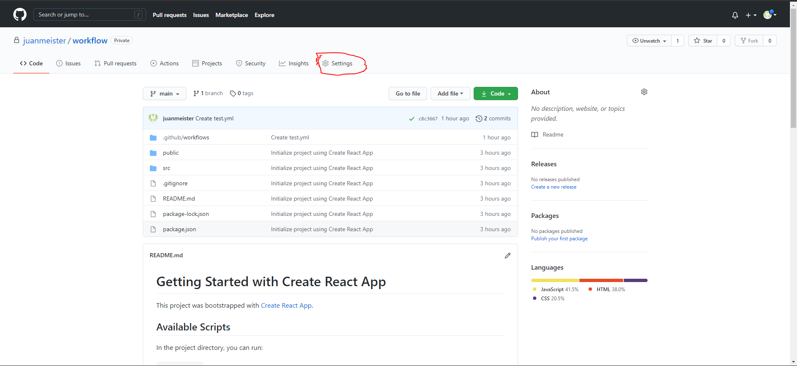
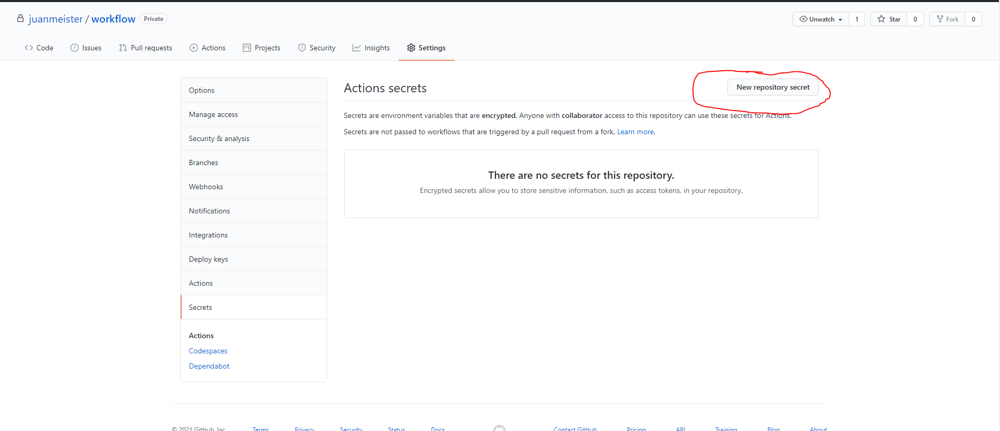
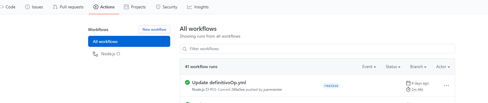

# Crear CI(Integracion continua ) con Github Actions utilizando Node.js y Digital Ocean

## Introducción 
En esta guía busca mostrar un paso a paso para crear un Workflow (Flujo de trabajo) dentro de GitHub Actions.
Para este ejemplo se utilizará la herramienta de react `créate-react-app`.

Es necesario tener un droplet creado dentro de Digital Ocean, si no sabe cómo crear uno puede seguir estos pasos en [esta guía Fazt](https://www.youtube.com/watch?v=Z4yeRyf8MhM&ab_channel=FaztCode).

#### Create React App
"Create React App es un ambiente cómodo para `aprender React`, y es la mejor manera de comenzar a construir `aprender React` usando React".
para mas informacion [hacer click aqui](https://es.reactjs.org/docs/create-a-new-react-app.html)

## Indice:
1. [Crear Proyecto y subir a github](#Crear-Proyecto-y-subir-a-github)
1. [Preparar Servidor e instalar nginx](#Preparar-Servidor-e-instalar-nginx)
1. [Crear Workflow](#Crear-Workflow)
1. [Crear Variables de Entorno y configurar ssh para Github](#Crear-Variables-de-Entorno-y-configurar-ssh-para-Github)
1. [Push a main](#Push-a-main)

# Crear Proyecto y subir a github

### Crear Proyecto

Abrir una terminal y ejecutar los siguientes comandos.(cabe recalcar que es necesario tener instalado node y npm en su equi [click aqui para mas](https://es.reactjs.org/docs/create-a-new-react-app.html))

```bash
mkdir myApp && cd myApp
npx create-react-app my-app
cd my-app
npm start
```
En su navegador debió abrirse este proyecto en el localhost:3000:
<p align="center">
  
</p>

### Subir a Github
Detener el proceso en ejecucion de react. Crear un nuevo repositorio en github
<p align="center">
  
</p>

En el terminal donde esta ubicado el proyecto ejecutar los siguientes comandos
```bash
git branch -M main
git remote add origin https://github.com/username/suRepo.git
git push -u origin main
```


# Preparar Servidor e instalar nginx

Para este ejemplo se trabajara directamente con el usuario  **root**.
Esta la configuracion bastante resumida y basica, si quieres tener mas detalle [entrar aqui](https://www.digitalocean.com/community/tutorials/how-to-install-nginx-on-ubuntu-20-04-es)

### acceder al servidor
Abrir un nuevo terminal y ejecutar
```bash
ssh root@`ip del servidor`
```

### Instalar y configurar nginx
Actualizar paquetes de Ubuntu e Instalar nginx
```bash
sudo apt update
sudo apt install nginx
```

Aplicar ajustes al firewall
```bash
sudo ufw app list
sudo ufw allow 'OpenSSH'
sudo ufw enable
sudo ufw allow 'Nginx HTTP'
sudo ufw status
```

Comprobar estado del servidor web
```bash
systemctl status nginx
```

Para comprobar que quedo bien confirgurado nginx acceder a http://your_server_ip, debiese de arrojar este resultado
<p align="center">
  
</p>

# Crear Workflow
### Crear archivo .yml
Dentro del repositorio dirigirse a `Actions` ubicada en la cabecera
<p align="center">
  
</p>

Github detecta el lenguaje con el que se trabaja y entrega opciones de planillas para crear el archivo .yml, en este caso hay que seleccionar el que dice `Node.js`
<p align="center">
  
</p>

Una vez seleccionado poner **nombre** al archivo y precionar en **start commit**
<p align="center">
  
</p>

### Modificar y preparar .yml

Ahora hay que modificar el archivo directamente desde github o trabajandolo desde el editor de codigo a elección. El archivo inicial debio quedar así.
```bash
name: Node.js CI

on:
  push:
    branches: [ main ]
  pull_request:
    branches: [ main ]

jobs:
  build:

    runs-on: ubuntu-latest

    strategy:
      matrix:
        node-version: [10.x, 12.x, 14.x, 15.x]
        # See supported Node.js release schedule at https://nodejs.org/en/about/releases/

    steps:
    - uses: actions/checkout@v2
    - name: Use Node.js ${{ matrix.node-version }}
      uses: actions/setup-node@v1
      with:
        node-version: ${{ matrix.node-version }}
    - run: npm ci
    - run: npm run build --if-present
    - run: npm test
```
Lo primero que se debe modificar es cuando se ejecutara el workflow(flujo de trabajo), en este caso solo se ejecutara cuando se le haga un push a la rama `main`. (es recomendable siempre ejecutarlo en una rama secundaria  antes que en la principal )
```bash
on:
  push:
    branches: [ main ]
```

Para las tareas que debe realizar workflow se debe indicar que servidor ejecutara los comandos y que versión de node se utilizara, en este caso las tareas se realizaran directamente desde el terminal de github y se utilizara solo la versión 12 de node. 
Cabe destacar que se puede utilizar desde el mismo terminal del servidor y que también se puede trabajar con más de una versión de node.
```bash
jobs:
  build:

    runs-on: ubuntu-latest

    strategy:
      matrix:
        node-version: [12.x]
```

a continuación, se indican las tareas que deben realizar el workflow
```bash
steps:
    - uses: actions/checkout@v2
    - name: Use Node.js ${{ matrix.node-version }}
      uses: actions/setup-node@v1
      with:
        node-version: ${{ matrix.node-version }}
    - run: npm install
    - run: CI=false npm run build
    - name: Copy file via scp 
      uses: appleboy/scp-action@master
      env:
        HOST: ${{ secrets.SSH_HOST }}
        USERNAME: ${{ secrets.SSH_USERNAME }}
        KEY: ${{ secrets.SSH_KEY }}
      with:
        source: "./build/*"
        target: "~/"
    - name: Script Digital Ocean
      uses: appleboy/ssh-action@v0.1.2
      with:
        host: ${{secrets.SSH_HOST}}
        key: ${{secrets.SSH_KEY}}
        username: ${{ secrets.SSH_USERNAME }}
        script: |
          sudo rm -rf /var/www/html && sudo mv ~/build /var/www/html
```
Los comando dentro del `Copy file via scp ` copian la carpeta build dentro del servidor, para ello es necesario espesificar las credenciales que le permitiran a github trabajar con el droplet de digital Ocean.

Esta tarea se realizara dento de digital Ocean, movera el archivo copiado dentro de la carpeta `/var/www/html` para que nginx muestre la app directamente desde la ip del servidor o del dominio.
```bash
    - name: Script Digital Ocean
      uses: appleboy/ssh-action@v0.1.2
      with:
        host: ${{secrets.SSH_HOST}}
        key: ${{secrets.SSH_KEY}}
        username: ${{ secrets.SSH_USERNAME }}
        script: |
          sudo rm -rf /var/www/html && sudo mv ~/build /var/www/html
```

El archivo final devio quedar así
```bash
name: Node.js CI

on:
  push:
    branches: [ realese ]
  pull_request:
    branches: [ main ]

jobs:
  build:

    runs-on: ubuntu-latest

    strategy:
      matrix:
        node-version: [12.x]

    steps:
    - uses: actions/checkout@v2
    - name: Use Node.js ${{ matrix.node-version }}
      uses: actions/setup-node@v1
      with:
        node-version: ${{ matrix.node-version }}
    - run: npm install
    - run: CI=false npm run build
    - name: Copy file via scp 
      uses: appleboy/scp-action@master
      env:
        HOST: ${{ secrets.SSH_HOST }}
        USERNAME: ${{ secrets.SSH_USERNAME }}
        KEY: ${{ secrets.SSH_KEY }}
      with:
        source: "./build/*"
        target: "~/"
    - name: Script Digital Ocean
      uses: appleboy/ssh-action@v0.1.2
      with:
        host: ${{secrets.SSH_HOST}}
        key: ${{secrets.SSH_KEY}}
        username: ${{ secrets.SSH_USERNAME }}
        script: |
          sudo rm -rf /var/www/html && sudo mv ~/build /var/www/html
```

# Crear Variables de Entorno y configurar ssh para Github

Las 3 variables de entono a crear son: 

- SSH_HOST= ip o dominio del servidor.
- SSH_KEY= la llave privada ssh.
- SSH_USERNAME= el usuario utilizado dentro del servidor en este caso `root`.

Para agregar una variable al repositorio en gibhub seguir los siguientes pasos:

 1. entrar en Settings
<p align="center">
  
</p>

 2. en las opcion Secrets precionar New repository secret
<p align="center">
  
</p>

 3. Ahora ingresar el nombre y el valor 
<p align="center">
  
</p>

## Configurar Llave Llave ssh 
Dentro del servidor o directamente de manera local [crear una llave ssh](https://docs.github.com/es/github/authenticating-to-github/generating-a-new-ssh-key-and-adding-it-to-the-ssh-agent). La llave publica la podremos en el archivo `authorized_keys` y la privada la copiaremos dentro del a variable `SSH_KEY`.

El archivo `authorized_keys` se encuentra dentro de la carpeta .ssh, para llegar al directorio ejecute el siguite comando:
```bash
cd ~/.ssh
ls
vim authorized_keys
nano authorized_keys
```
con `nano` o `vin` copiar la llave .

# Push a main

Una vez creadas las variables de entorno y configurado la llave publica dentro del servidor, es hora de hacer commit a los cambios seguido de un push a la rama pricipal para observar la magia. Puede ver el movimientos desde Actions
<p align="center">
  
</p>


